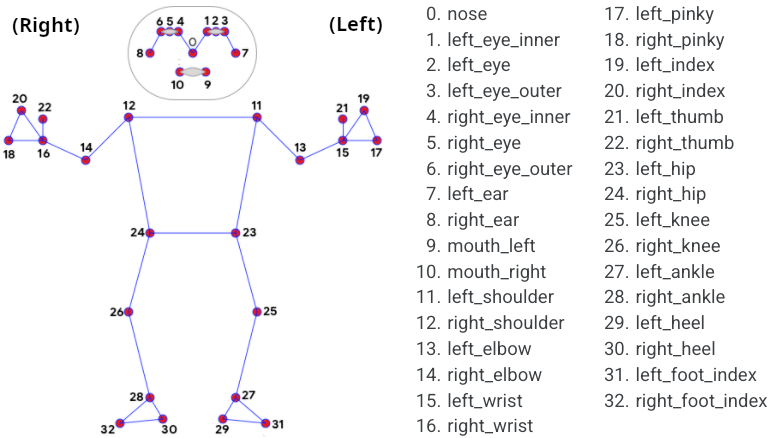
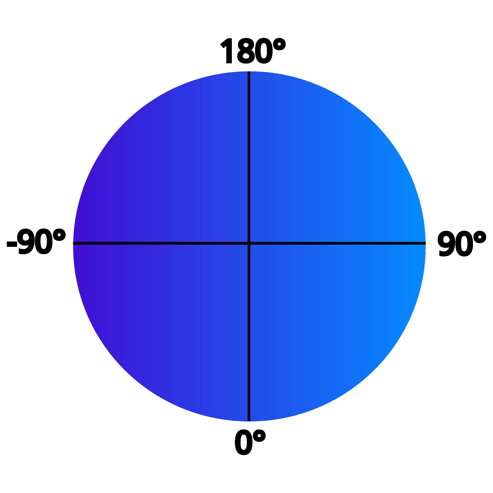
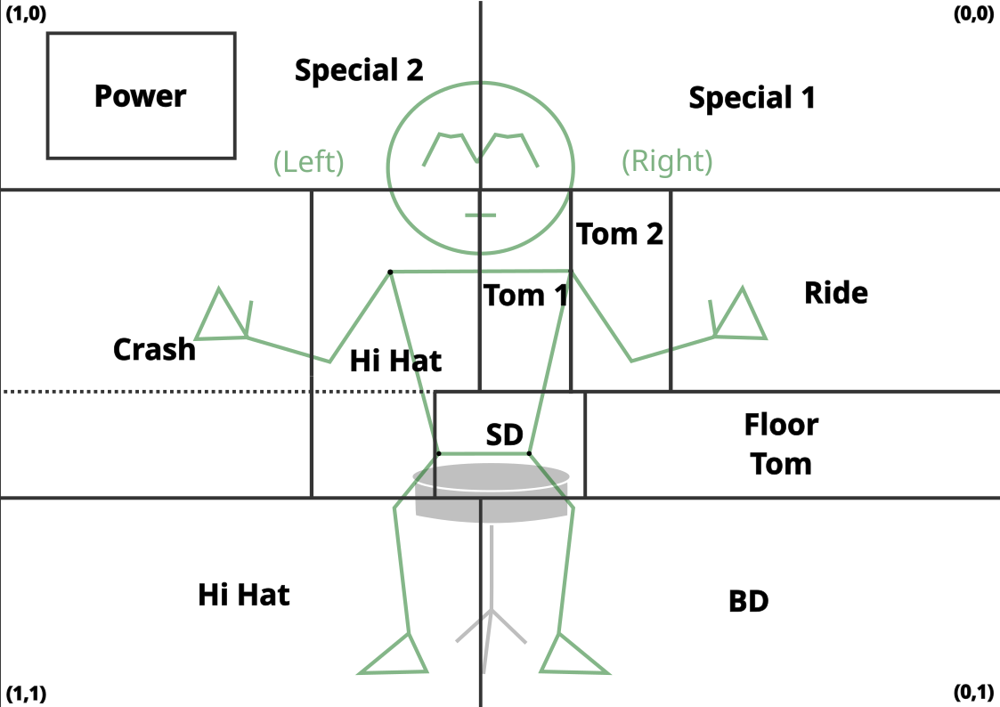

# Invisible Drum Set App

Inspired by Rowan Atkinson's classic air drumming act, this Python app script enables a user to play on their own invisible drum kit.

The app primarily uses Mediapipe Pose, a Pose Estimation library developed by Google, and OpenCV, a library for live video and image processing for Computer Vision (CV) applications. A "hit check" function within the program responds whenever a hand or foot "hits" an invisible object with a like drum sound, dependent on hit location.

This app does not require drum set experience, though it is recommended.

## Installation and Physical Setup

To use the app, clone the content in this repository or download and extract the .zip file, then run `motion_project.exe`.

`git clone https://github.com/MathdudeMan/Motion-Project`

The user should be seated on a stool or chair. The drum function may only be activated when all four torso nodes (shoulders and hips) are in frame. Thus, it is recommended that the user's webcam or external camera be set up at least 4-6 feet away from the stool, allowing the full body of the player to fit within the camera frame.

## How It Works

`motion_project.exe` functions as a fullscreen window that mirrors the user via the computer's live built-in webcam. Drum "hits" are determined by calculating the real-time changes in velocity of each extremity (hands and feet) of the user. A good down-up wrist snap should trigger this.

The "drum kit" is powered off by default. To activate the kit, perform the following:

1. Position the user's torso (i.e. both shoulders and hips) completely in the webcam frame.
2. With the app's video output as a guide, use any extremity to "hit" the "Power" button in the top left corner of the mirrored screen.

The app transitions between three different states, triggered by user behavior.

1. User Offscreen. This displays the message "User Not In Frame." Triggered whenever torso exits the frame.
2. Power Off: User onscreen, but sound function not switched on. Automatic setting upon user entering frame.
3. Power On: User onscreen with audio activated. Triggered by "hitting" the button in the top-left corner.

### Mediapipe Pose

Mediapipe Pose detects 32 standard nodes from the human body. The source code configures these as shown:

Further documentation on MediaPipe Pose may be found [here](https://ai.google.dev/edge/mediapipe/solutions/vision/pose_landmarker).

### Hit Check

For every frame, the x, y, and visibility (0 - 1) parameters for each node in the torso and extremities (hands/feet) are saved. The `hitCheck()` function then calculates the angle, angular velocity, and vertical velocity for the extremity. If the angular or vertical velocity values of the limb have a sharp spike (delineated by fixed numeric criteria), this registers a "hit."

For reference, `hitCheck()` calculates the extremity angles with the following degree plane:

When a hit is registered, the program uses the location of the extremity relative to the rest of the body to map what drum or cymbal in the hypothetical drum kit was "hit." An appropriate drum or cymbal sound is triggered to match.

Note that there is a buffer built in to the playsound library, so the audio playback for hits will be delayed.

### Hit Grid

The drum mapping is done using a "hit grid." The hit grid holds the x/y ranges of imaginary drum components assigned based on the user's present location in the frame. These ranges are recalculated each frame based on the torso node locations with the function `updateGrid()`.

#### Hit Grid (After Image Mirroring):

This method allows accurate drum mapping regardless of the location or size of the user in the frame.

## Licensing

All sound effects in this app are obtained from from , a repository for free and open source audio.

This project is copyright protected by the MIT License.
