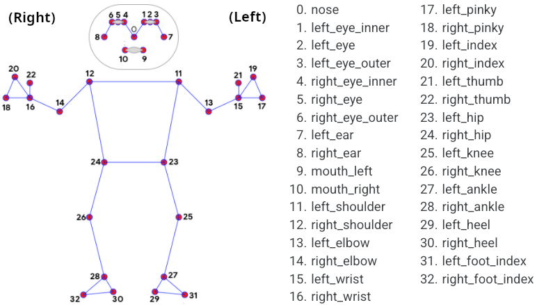
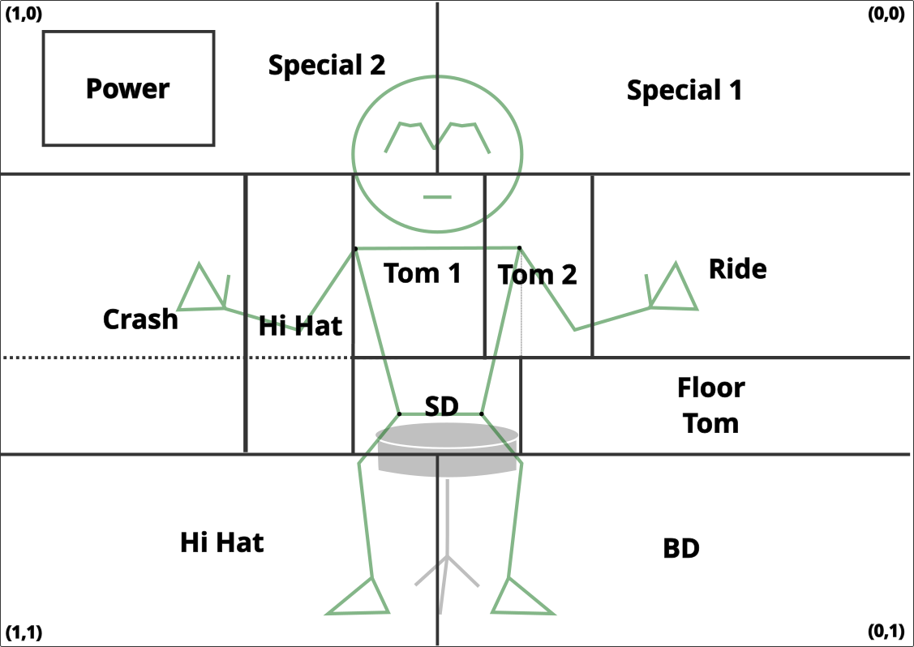

# Invisible Drum Set App

Inspired by Rowan Atkinson's classic air drumming act, this Python app enables a user to play on their own invisible drum kit.

The app primarily uses Mediapipe Pose, a Pose Estimation library developed by Google, and OpenCV, a library for live video and image processing for Computer Vision (CV) applications. A "hit check" function within the program responds whenever a hand or foot "hits" an invisible object with a like drum sound, dependent on hit location.

## Installation and Physical Setup

To use the app, clone the content in this repository or download as a .zip file, then run the `motion_project.exe` file in the folder.

<!-- `Repo clone` -->

Best practice requires the user to be seated on some stool or chair. The drum function may only be activated when all four torso nodes (shoulders and hips) are in frame. Thus, it is recommended that the user's webcam or external camera be set up at least 4-6 feet back from the stool position, allowing the full body of the player to fit in the camera frame.

## How It Works

The `motion_project.exe` file functions as a fullscreen window that mirrors the user via the computer's live built-in webcam. Drum "hits" are determined by calculating the real-time changes in angular velocity of each extremity (hands and feet) of the user. Imagine a drumstick in hand when doing so.

The "drum kit" is powered off by default. To activate the kit, perform the following:

1. Position the user's torso (i.e. both shoulders and hips) in the webcam frame.
2. With the app's video output as a guide, use any extremity to hit the "Power" button in the top left corner of the mirrored screen.

### Mediapipe Pose

Mediapipe Pose has 32 standard nodes it may detect from the human body. These are set as shown:

You may find further documentation on the MediaPipe Pose library [here](https://ai.google.dev/edge/mediapipe/solutions/vision/pose_landmarker).

### Hit Check

Each frame, the x, y, and visibility values are saved for each node in the torso and extremities (hands/feet). The hit check function then calculates the angle, angular velocity, and y-velocity for the extremity. If the angular or vertical velocity values of the limb spike upwards, this registers a "hit."

When a hit is registered, the program then uses the location of that extremity in the camera view, relative to the rest of the body, to find what drum or cymbal in the kit was "hit." An appropriate drum or cymbal sound is triggered to match.

### Hit Grid

The drum mapping is done using a "hit grid." The hit grid holds the euclidian ranges of a hypothetial drum kit's components relative to the user's present location in the frame, which are recalculated every frame. These ranges are calculated based on the torso node locationsin the function "updateGrid()".

#### Hit Grid (After Image Mirroring)

This method allows accurate drum mapping regardless of the location or size of the user in the frame.

## Licensing

This app uses free and open source sound effects from . The contributors of these sounds are as follows:

[Contrib A]()
[Contrib B]()
