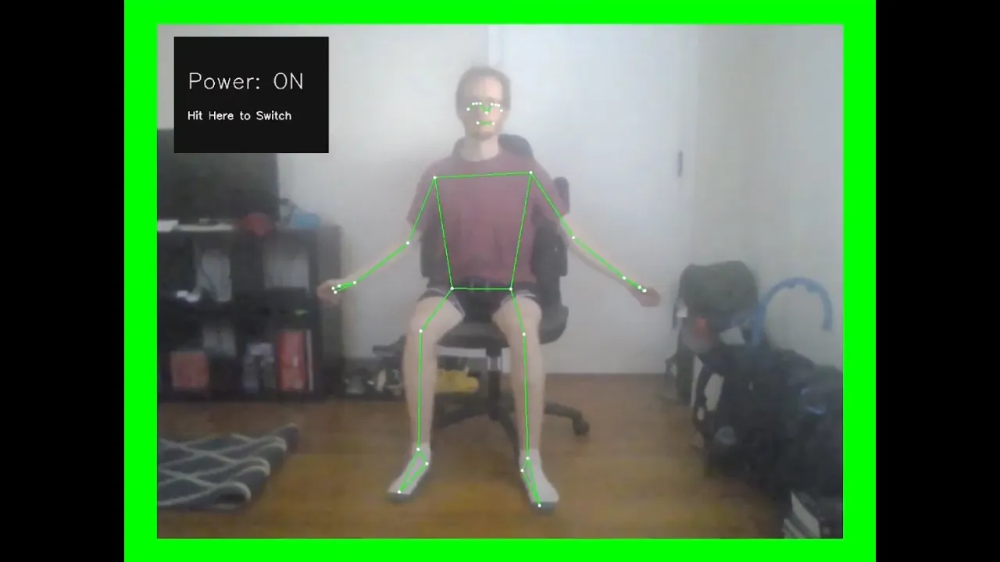
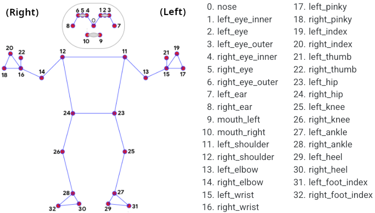
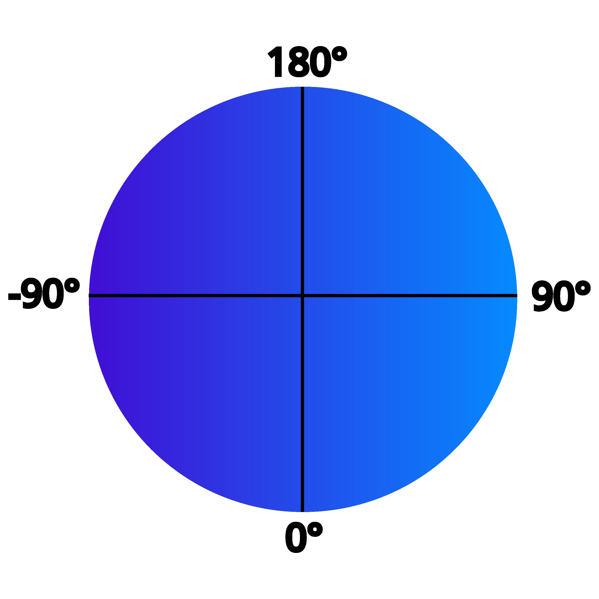
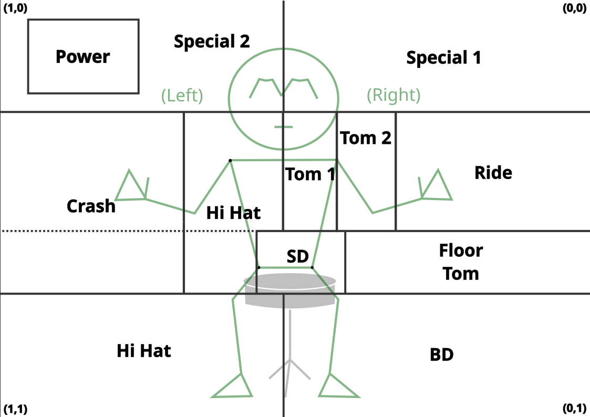

# Invisible Drum Set App

Inspired by Rowan Atkinson's classic air drumming act, this Python app enables a user to play on their own invisible drum kit.

The app functions using Google's Mediapipe Solutions Pose Landmark Estimation as a base model, with OpenCV for pre-processing and post-processing. The Mediapipe outputs construct a "drum grid" of drum positions for each frame. Then, each limb is checked for "hitting" an object based on a sliding-window angle-calculation algorithm, to which the app responds with the appropriate sound sample.

## Installation and Physical Setup

To use the app, clone the repo and run `main.py`. The app may be packaged using **pyinstaller**.

The app defaults to using the user's webcam (or the computer's primary camera port). For best results, the user should be seated on a stool or chair in frame at least 4-6 feet away from the webcam.

## How It Works

The app displays a mirror of the user's webcam capture. Drum "hits" are found by a brute-force calculation of angular acceleration for each user extremity (hands and feet) - a good down-up wrist snap should trigger this.

On startup, the drum kit audio is disabled. The app operates between three different states, controlled by user's being in-frame motion-operating the corner Power button:

1. User Offscreen ('Out'): This displays the message "User Not In Frame." Triggered when user torso exits the frame.
2. Power Off ('Off'): User onscreen, with audio inactive. Triggered automatically when user torso re-enters frame.
3. Power On ('On'): User onscreen with audio activated. Triggered from the Off state by "hitting" the button in the top-left corner with a hand.

### Mediapipe Pose Model

**Mediapipe Solutions Pose Landmark Detection** detects 32 standard nodes from the human body. The source code configures these as shown:

Further documentation on MediaPipe Pose may be found [here](https://ai.google.dev/edge/mediapipe/solutions/vision/pose_landmarker).

### Frame-by-Frame Analysis

Each frame, Mediapipe returns the x, y, and visibility (0 - 1) parameters for each Pose node. These are saved alongside freshly-calculated values for all extremity angles and velocities. The "hit" algorithm reacts to spikes in angular or vertical velocity values for each extremity. In the code, the angles use the following degree plane:

When a hit is registered, the program uses the extremity's location in frame and the "hit grid" below to map to a drum or cymbal. The grid ranges are recalculated each frame based on the user's hip and shoulder locations. This method allows for more accurate drum mapping regardless of the user's position in the frame.

#### Drum Grid:

All sound samples in this app are obtained from from . These are free and open-source.

There is high latency to audio sample playback, due largely to the Python runtime.
